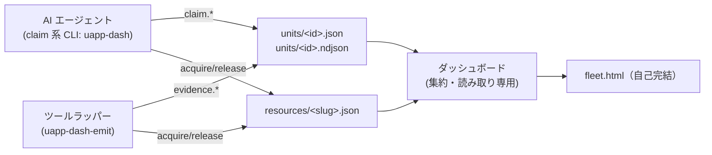

# エージェント開発ステータス・プロトコル v0

複数の AI エージェントが同一ホスト上の複数 Unity プロジェクトを並行開発する状況を監視するための、
**ファイルベースの契約**。サーバー不要・書き手は自分の分だけ書く・読み手（ダッシュボード）が派生物を作る。

この文書がプロトコルの正本。連携する E2E キット側の薄いエミッタは別リポジトリの issue #9 で実装する。

## 0. 設計判断

| # | 判断 | 理由 |
|---|---|---|
| A | **単一の `status.json` を持たず、開発単位ごとにファイルを分ける** | 1プロジェクト:N単位を採る以上、同一ファイルへの並行書き込みが必然になる。Windows に多プロセス安全な read-modify-write は無く lost update が起きる。書き手が自分のファイルだけを原子的に置換すれば競合が消える。フリート表示用の集約はダッシュボードが生成する派生物とする |
| B | **停滞判定は固定しきい値でなく、書き手が宣言する TTL** | Android ビルド 十数分〜23分・E2E 数分・EditMode テスト 20〜30秒・エディタコールド起動 約60秒と幅が大きい。固定5分では長時間ビルドが全て「停滞」になる |
| C | **`stalled` / `crashed` は宣言できない**（読み手が計算する） | 自己申告できる停滞は停滞ではない。TTL 超過に加えて `owner.pid` の生存を見て「ハング」と「プロセス消失」を区別する |
| D | **claims（編集領域）は勧告のみ**。強制ロックしない | 強制すると AI が詰まり、CLI 非経由の手作業も壊れる。実力の排他は各ツール側のロック（例: Play 占有の Mutex）が担い、本プロトコルはその可視化と二重系に徹する |
| E | **エージェントはエビデンスを書けない**（claim 系 CLI に該当サブコマンドが無い） | 自己申告と客観エビデンスの二層化は「AI が良い数字を書けてしまう」と成立しない。claim 系 CLI（`uapp-dash`）とツール用エミッタ（`uapp-dash-emit`）をエントリポイントごと分離する |

## 1. ディレクトリ配置

```
<project>/.agent-status/          ← 必ず .gitignore する（ホスト名・絶対パス・一時状態を含む）
├── units/
│   ├── <unit-id>.json            現在状態のスナップショット（その単位だけが書く／原子的置換）
│   ├── <unit-id>.ndjson          その単位のイベントジャーナル（追記のみ・1行1イベント）
│   └── done/                     終了した単位の退避先（集約は既定で直近50件のみ読む）
├── resources/
│   └── <slug>.json               排他資源の現在の保持者（1資源1ファイル）
├── .locks/                       排他区間のロックファイル（中身は空・消えても記録は失われない）
└── project.json                  任意。表示名などのメタ情報
```

**ロックファイルは記録と同じ場所に置かない**。`units/done/` や `resources/` に `*.lck` が
混ざると「消してよいのか分からない残骸」に見える（実運用で問題になった）。



### 排他資源の ID 語彙

実際に衝突が起きた資源だけを語彙にする（増やさない）。

| 資源 ID | 意味 |
|---|---|
| `editor-play:<projectPath>` | Unity エディタの Play 占有 |
| `build:<projectPath>` | Unity Library ロック・重量ビルドの直列化 |
| `device:<serial>:<port>` | デバイス内の計装アプリ待受ポート |
| `host-port:<port>` | ホスト側の転送ポート |

取得・解放の約束（ファイルだけで排他するため、素朴に書くと壊れる）:

- **判定と書き込みは OS のファイルロック（`msvcrt.locking` / `flock`）で囲んだ排他区間の中で行う**。
  ファイルの有無や付け替えだけで排他を作ると、「取り残したロックをどう回収するか」で必ず新しい
  レースが生まれる。OS のロックは**保持プロセスが死んだ時点で必ず解放される**ので取り残しが起きない
- ロック記録は `lockId`（毎回の乱数）を持つ。**解放できるのは同じ `lockId` か同じ `unitId` を持つ者だけ**。
  「同じホストなら同じ」といった緩和は入れない（無関係な取得者のロックを解放できてしまう）
- 作業単位に紐付けずに取得した場合、`lockId` を呼び手へ返す（解放手段が無くなるのを防ぐ）
- **生存を判定できない保持者（他ホスト・pid 未記録）のロックは奪わない**
- 排他区間に入れなかった操作は**失敗として返す**（待ち続けず、壊しにも行かない）
- 解放の結果は **`released` / `absent`（記録なし）/ `not-owner`（別の保持者）/ `busy`（操作中）** に分ける。
  「解放できなかった」を一括りにすると、もう自分のものでない資源を抱え続けて終了処理が永久に失敗する

## 2. 単位スナップショット `units/<unit-id>.json`

```json
{
  "schema": "uapp-dash/status/0",
  "unitId": "u-20260726-001500-a1b2",
  "project": { "path": "D:\\WinDev\\AI\\uapp_e2e", "name": "uapp_e2e" },
  "label": "issue #8 プロトコル v0 実装",
  "owner": { "agent": "claude-code", "session": "…", "pid": 12345, "host": "HOST-01" },
  "state": "running",
  "activity": "unity test EditMode 実行中",
  "startedAt": "2026-07-26T00:15:00+09:00",
  "lastHeartbeat": "2026-07-26T00:19:02+09:00",
  "ttlSec": 300,
  "tasks": [
    { "id": "t1", "title": "スキーマ確定", "status": "done" },
    { "id": "t2", "title": "CLI 実装", "status": "todo" }
  ],
  "claims": [
    { "path": "src/**", "mode": "shared" },
    { "path": "Assets/Scenes/Main.unity", "mode": "exclusive" }
  ],
  "resources": ["editor-play:D:\\WinDev\\AI\\uapp_e2e\\unity-nis"],
  "lastEvidence": { "kind": "evidence.test", "at": "…", "ok": true, "summary": "EditMode 12/12" },
  "eventCount": 17,
  "endedAt": null,
  "result": null
}
```

- **時刻は必ずオフセット付き ISO 8601**（`+09:00`）。naive 表記は禁止（読み手はローカル時刻として解釈しつつ警告を出す）
- **書き込みは原子的置換**（同一ディレクトリに一時ファイル → `os.replace`）。読み手はロックを取らず、壊れた JSON を読んだら 1 回だけ再試行する
- **置換は短い再試行を伴う**。Windows では読み手がファイルを開いている間の置換が共有違反で失敗しうるため、
  表示のために開かれただけで書き手が落ちないようにする
- **スナップショットを書いてよいのはその単位の所有者だけ**。エビデンスを書く道具は
  **ジャーナルに追記するだけ**にする（共有ファイルの read-modify-write は他コマンドの更新を巻き戻す）
- `state` の宣言可能値: `running` / `waiting-approval` / `blocked` / `review` / `done`
- `result`（`state=done` のとき）: `success` / `failure` / `aborted` / `dropped`
  - `dropped` は 0.1.6 で追加（**再開しないと決めた取りやめ**。宿題が残りうる `aborted` と
    使い分け、要注意にも進行中にも出さない）。旧読み手が未知の `result` を読んだ場合は
    `done` として畳む（読み手は未知の語彙で止まらない）
  - `supersededBy`（任意・0.1.6 で追加）: `failure` / `aborted` の単位が「目的を引き継いだ
    別単位」を指す。読み手は ack と同様に要注意から外す

### 表示順（要注意ファースト）

```
1. waiting-approval  人が承認しないと進まない
2. blocked           資源待ち・入力待ち
3. crashed           TTL 超過かつプロセス消失
4. failed / aborted  result が success でない
5. stalled           TTL 超過（プロセスは生存）
6. review            レビュー待ち
7. running           実行中
8. done / dropped / idle  完了・取りやめ・待機
```

同順位内は「最後の更新からの経過時間」の降順。**時系列ソートは既定にしない**。

## 3. イベントジャーナル `units/<unit-id>.ndjson`

1 行 1 JSON。共通封筒:

```json
{ "schema": "uapp-dash/event/0", "at": "2026-07-26T00:19:02+09:00",
  "unitId": "…", "seq": 42, "producer": "agent", "kind": "claim.heartbeat", "data": { } }
```

追記の約束（複数プロセスが同じジャーナルへ書きうるため）:

- **1 行は短く保つ**（数百バイト目安）。OS は任意長の追記の原子性を保証しない
- **単位の解決（ツール側）**: `uapp-dash-emit` は「明示 `--unit-id` → 環境変数 →
  **進行中の単位がちょうど 1 件ならその単位** → `ambient-<host>`」の順で決める。
  ラッパーは AI と別プロセスで動くため unitId も環境変数も届かないことが多く、そのままでは
  申告中の作業とエビデンスが別々の単位に入り、**単位レベルで申告と実測を突き合わせられない**
  （二層化の目的が成立しない）。進行中が 0 件（誰の作業でもない）か 2 件以上（どちらか決められない）なら
  `ambient` のままにする。自動で結びつけた場合は `data.unitIdSource = "active-unit"` を残し、
  後から根拠を辿れるようにする。
  **候補が「TTL 切れの単位 1 件だけ」だった場合は `data.unitIdSource = "ambient-unit-overdue"`**
  を残す（結びつかない理由が後から分かる。運用では TTL 切れに気づけず、なぜ ambient に
  落ちたのか追えなかった）
- **`seq` はベストエフォート**。単位の所有者は通し番号を付けてよいが、外部の道具は `0`（不明）を書く。
  読み手は `seq` の連番性・一意性に依存してはならない。
  **`uapp-dash-emit` は常に `0` を書く**（並行追記では通し番号を保証できないため採番しない）。
  **同一単位内の前後関係は `at` で見る**こと。ツールの記録が全件 `0` に見えても壊れてはいない
- **読み手は壊れた行を黙って捨てる**（追記途中の欠けた行を掴んでも止まらないこと）。
  スナップショットも同じで、**1 ファイルの異常で集約全体を止めてはならない**。
  実装上の落とし穴（実測）: JSON として正しくても `json.loads` が失敗する入力がある
  （4300 桁を超える整数リテラル）／`NaN`・`Infinity` は読めてしまうが、そのまま出すと
  ビューアー側の JSON パースが拒否する／極端に大きな日時に TTL を足すと日時の上限を超える。
  読み手は**値の異常を捨てるか丸めるかして、必ず動き続ける**こと
- **読み手が `at` で並べ直し、完全に同一の行は 1 件に畳む**。退避時の追記マージで前後が入れ替わったり、
  途中で落ちた再実行で同じ行が二重に入っても、表示が壊れないようにする
- **読み手は進行中と `done/` の両方のジャーナルを読む**。退避の最中に届いた行は進行中側に
  新しく作られるため、片方だけ読むと落ちる（退避側は先にリネームで切り離してからマージする）

### claim 系（`producer` = `agent`）

| kind | data | 備考 |
|---|---|---|
| `claim.begin` | `label, tasks[], claims[], owner` | 単位の開始。unitId を採番して返す |
| `claim.heartbeat` | `state, activity, ttlSec, progress?` | 生存＋現在の作業。長時間処理の前に `ttlSec` を伸ばす。**状態も作業内容も変わらない場合はスナップショットのみ更新し、ジャーナルには書かない**（肥大化防止） |
| `claim.task` | `taskId, status: done\|dropped, note?` | 消化率の元データ |
| `claim.blocked` | `reason, needs: approval\|input\|resource, resource?` | `needs=approval` が最優先表示 |
| `claim.note` | `text` | 補足。表示は最下位 |
| `claim.resource` | `resource, action: acquire\|release\|denied, holder?` | エージェント自身による排他資源の取得/解放（実装時に追加。ツールが書くものは `evidence.resource`） |
| `claim.end` | `result: success\|failure\|aborted\|dropped, summary, supersededBy?` | 掴んでいる排他資源を解放し、単位を `units/done/` へ移す。**`busy` の資源が残る場合は `done` にせず `blocked`（needs=resource）のまま失敗させる**（`done` にすると集約でも表示でも畳まれ、塞がった資源が視界から消える）。ジャーナルは**切り離してから追記マージ**する（退避中の追記を失わない） |

**申告テキストに数字を書かせない**: `claim.end` の `summary` と `claim.heartbeat` の `activity` に
テスト件数らしき数字（`39/39`・`2 failed`・`15 件通過` 等）があれば、CLI が**警告を 1 行出す**
（止めない）。二層化の前提は申告側に数字が無いことで、あると人が申告を読んで納得してしまい、
エビデンスとの食い違いに気づけない。**規約を読ませるだけでは守られない**（AI が
「承知していたのに書いた」と自己報告した実例がある）ため、書いた瞬間に知らせる。

### evidence 系（`producer` = `tool`・エージェントからは書けない）

| kind | data |
|---|---|
| `evidence.test` | `suite: unity-editmode\|unity-playmode\|e2e\|unit, passed, failed, skipped, exitCode, durationSec, reportPath?` |
| `evidence.e2e` | 上記＋ `journeyReport?, regressed?, failureDir?` |
| `evidence.build` | `target, exitCode, durationSec, artifactPath?, sizeBytes?` |
| `evidence.git` | `action: commit\|branch, sha, subject, files, branch` |
| `evidence.resource` | `resource, action: acquire\|release\|denied\|wait, holder` — **集約側は最新の `acquire` を「保持中」として資源パネルに出し、`release` で消す**（`source: "tool"` が付く）。ラッパー側のロック（キットのプロセス間 Mutex 等）は AI の申告に依存せず効くので、これを記録すると「効くほう」と「見えるほう」が一致する。申告レーン（`resources/` の実ファイル）に同じ資源があればそちらを優先する |
| `evidence.device` | `serial, load1, uptimeSec, ports[]` |

**エビデンスの成否判定**: `data.ok` があればそれ。無ければ `exitCode == 0` かつ `failed == 0` を成功とする。

**不一致の自動検出**（二層化の実利）: `claim.task status=done` の直後に同一単位の赤いエビデンスがある場合、
または `claim.end result=success` の直前に赤いエビデンスがある場合、「申告とエビデンスの不一致」として要注意に格上げする。

## 4. claims（編集領域の宣言）と重複警告

- 形式: `{ "path": <グロブ or ファイルパス>, "mode": "shared" | "exclusive" }`（プロジェクトルート相対・区切りは `/`）
- **Unity 固有の昇格規則**（マージ困難な YAML は行単位の共存が成り立たない）:
  - `*.unity` / `*.prefab` / `*.asset` を直接指すものは、指定にかかわらず **exclusive**
  - 上記に一致したら `<同名>.meta` も同伴で exclusive として追加する
  - `ProjectSettings/**` と `Packages/manifest.json` に重なるものは宣言内容にかかわらず **暗黙 exclusive**
    （エディタ起動だけで `runInBackground` や `minSdkVersion` が書き換わるため）
- **比較は大小文字を区別しない**（Windows / macOS のファイルシステムに合わせる。区別すると
  `Assets/...` と `assets/...` を別物と見なして見落とす）。同伴の `.meta` も判定に使い、
  表示上の重複だけを本体パスに正規化して排除する
- **CLI の `--claims` は空白区切り（値ごと）だが、`;` 連結も受け付けてほどく**。
  隣の `--tasks` が `;` 区切りなので取り違えが起き、`;` を含む 1 本のパスが claim になって
  **衝突検出が静かに無効化されていた**（導入先で 2 回とも間違い、記録を見るまで気づけなかった）。
  ほどいたときは警告を出す（黙って直すと次も同じ書き方をする）。
  **ほどくのは CLI の入口だけ**で、ライブラリ層（`normalize_claims`）は分割しない
  （`;` は正当なファイル名文字なので、保存済みの宣言を読むたびに書き換えてはならない）。
  リテラルの `;` を宣言したいときは **`\;`** とエスケープする
- **`doctor` は claims の書き方の事故を拾う**（全走査はしない）。ただし判定は**すべて `info`**＝
  終了コードを汚さない: `;` の混入は取り違えの疑いだが `\;` で意図的に宣言できるため誤りと
  断定できず、静的接頭辞が実在しないのも**正常**（規約は「編集する前に宣言する」。
  衝突判定はパターン比較で実在に依存しない）。人が読んで判断する材料として出す
- 判定: 単位間でパターンが重なり、かつ一方でも `exclusive` なら **conflict**（表示のみ・ブロックしない）
- 両方 `shared` でも、`Assets/` 配下のグロブ同士が重なる場合は **yaml-risk**（重なりの中に YAML 資産が入りうる）として弱い警告
- パターンの重なり判定は**保守的な近似**（過剰警告側に倒す）。ファイルシステムを走査せずパターン同士で判定する
- worktree 分離は前提にしない（Unity は Library 再生成コストが重い）。同一作業コピー内の領域分担が現実解であり、だから可視化が要る

## 5. 停滞・生存の判定

```
alive     = owner.host が自ホストで、owner.pid が生存している
overdue   = now > lastHeartbeat + ttlSec + 60s
state'    = state == "done"        -> result に応じて done / failed / aborted
          : overdue and not alive  -> "crashed"
          : overdue                -> "stalled"
          : state
```

- 既定 `ttlSec = 300`。ラッパーは長時間処理の直前に伸ばす（例: Android ビルド 2400、Unity テスト 900）
- ハートビートの推奨間隔は `ttlSec / 3`。書き手が死んでも TTL 超過で必ず検出される
- **期限切れは読み手に一次情報として見せる**（`units` は残り秒／期限切れを出し、`doctor` は
  「記録が結びつかないのは TTL 切れのため」と理由を言う）。`state` は宣言のままなので、
  `state: running` と期限切れは両立する＝**一覧だけでは切れていると読めない**という実害があった
- **期限切れの判定は 1 か所に集約する**（実装では `attention.heartbeat_window`、
  TTL の正規化は `protocol.ttl_of`。表示・停滞判定・エミッタの 3 つが別々に計算すると
  「TTL 残り 240 秒」なのに「停滞」かつ「エビデンスは ambient」になる）。境界の扱いも固定する:
  **`ttlSec` の欠損・`0`・負数・非数は既定値として扱い**（`0` を即座に期限切れと読むと合成した単位が
  一斉に切れる）、**巨大値は上限（30 日）で丸め**（桁の大きい値をそのまま時間差に足すと
  読み手が例外で落ち、1 単位で集約全体が死ぬ）、**時刻が読めない単位は期限切れ扱い**にする
  （新鮮だと証明できないものにツールの実測値を結びつけない）
- **人待ちの状態（`blocked` / `waiting-approval` / `review`）は停滞判定の対象にしない**。止まっているのが正常であり、
  もともと要注意順の上位に居るため見落とさない
- **`owner.host` が自ホストでない場合、生存確認はできないので `stalled` 止まり**にする（`crashed` と誤断定しない）
- **`owner.pid` は任意**。CLI は 1 コマンドごとに終了するため、**CLI 自身の pid を書いてはならない**
  （書くと即座に `crashed` と誤断定される）。エージェント本体のような持続プロセスの pid を
  `--pid` か環境変数で渡せたときだけ記録し、無ければ生存判定を行わない（`stalled` 止まり）
- **実運用では pid が無いのが普通**（AI はコマンドごとに別プロセス）＝ `crashed` はほぼ付かない。
  読み手は派生情報の `livenessKnown` を見て「停滞と消失を区別できない」ことを人に伝える。
  区別が要る場面（長時間ビルドを回すラッパー等）では、そのラッパーの pid を渡す
- pid の再利用による誤判定はありうる（同一 pid が別プロセスに再割当）。v0 では許容し、`startedAt` を併記して人が判断できるようにする
- 生存確認に **Windows で `os.kill(pid, 0)` を使ってはならない**（CPython の Windows 実装はシグナルを
  `TerminateProcess` に写像するため、確認のつもりで対象を殺す）。`OpenProcess` + `GetExitCodeProcess` で判定する

## 6. CLI 表面

```
uapp-dash init      [--project <path>] [--agents claude|codex|both]   .agent-status 作成・.gitignore 追記・申告規約の配置
uapp-dash doctor    [--project <path>]                            導入状況の自己診断（[未] があれば終了コード 1）
uapp-dash begin     --label <s> [--tasks "a;b;c"] [--claims <glob>...] [--ttl <sec>]   → unitId を stdout
uapp-dash heartbeat --state running|waiting-approval|blocked|review [--activity <s>] [--ttl <sec>]
uapp-dash task      <taskId> --done | --drop [--note <s>]
uapp-dash blocked   --reason <s> --needs approval|input|resource [--resource <id>]
uapp-dash end       --result success|failure|aborted [--summary <s>]
uapp-dash resource  acquire|release <resource-id> [--force]
uapp-dash units     [--all] [--json]                              進行中の単位を一覧（unitId を思い出す）
uapp-dash view      [--out fleet.html] [--serve [--port 8788]] [--open]
```

- 単位の同定は `--unit-id` または環境変数 `UAPP_DASH_UNIT_ID`（`begin` が stdout に出す）
- `--project` は**グローバル位置でもサブコマンドの後ろでも受け付ける**（前にしか置けないと、
  素直に書いた側が `unrecognized arguments` で弾かれる）
- `--agents` は監視対象へ**申告規約**を配る唯一の導線。`.claude/rules/agent-dash.md`（Claude Code）と
  ルートの `AGENTS.md`（Codex 等）へ置く。既存ファイルは書き換えず、統合用スニペットを表示するに留める
- **所有権はファイル中のマーカーで判定してはならない**。統合用スニペットにもマーカーは入るため、
  ユーザーが手で貼った瞬間に「自分の生成物」に化けてファイル全体を上書きしてしまう。
  書き込み時のハッシュを `.agent-status/agents.json` に記録し、**現物がその通りのときだけ更新する**
  （手で編集された生成物も上書きしない）。マーカーは doctor が「規約がそこに在る」ことを
  見つけるための検出用に徹する
- 要求された種別も同ファイルへ永続化する。**`both` と要求したなら両方が揃って初めて診断は成功**
  （片方でも満たせば成功にすると、既存 `AGENTS.md` がある環境で「Codex 側だけ未統合・
  ダッシュボードは空」が導入成功に見える）。記録の置き場は丸ごと無視される `.agent-status/` なので、
  **記録の消失・破損は「未要求」と区別して診断に出す**（黙って片方成功へ退行させない）
- 規約は **begin/end マーカーで挟んだ管理領域**として置き、判定は「**領域がちょうど 1 つで、
  中身が現行と一致するか**」で行う。マーカーや骨の文言だけを見ると古い版や節を削った本文でも
  「配置済み」になり、逆に「現行の全文を含むか」だけだと**旧規約を残したまま追記した状態**を
  通してしまう（矛盾する 2 つの規約を AI が読む）。テンプレートを更新すると既存の導入先は
  未了に落ち、`init --agents` で自分の生成物は自動更新される。またコマンドの有無は名前解決でなく**実際に起動し、版を突き合わせ、
  一時ディレクトリで `init` まで通して**確かめる（古い shim・同名の別コマンド・
  「パーサーは動くが本体が壊れている」インストールを [済] にしない）。
  子プロセスからは `PYTHONPATH` / `PYTHONHOME` を外す（作業ツリーへフォールバックさせない）
- **evidence 系サブコマンドは `uapp-dash` に無い**。ツール用の別エントリポイント `uapp-dash-emit <kind> --json <…>` を使う（判断 E）
- プロジェクトの発見: `begin` 時にユーザーごとのレジストリへ自動登録し、設定ファイルの走査ルートをフォールバックにする
- `uapp-dash init` は実装時に追加（#9 のエミッタが「`.agent-status` があるときだけ書く」ため、明示的な作成手段が要る）

## 7. エミッタ（ツール側）への要件

- 発火条件: 環境変数 `UAPP_E2E_STATUS_DIR` が**存在するディレクトリ**を指しているか、
  `<project>/.agent-status/` が既に存在するときのみ。**無ければ完全な no-op**
  （ファイルもディレクトリも作らず、呼び出し元の出力も増やさない）
- **探索は起点とその親の 2 階層まで**。それ以上遡ると、複数リポジトリを束ねた親ディレクトリの
  `.agent-status` を掴んで、導入していない別プロジェクトのジャーナルを汚す
- 書くのは**ジャーナルへの追記 1 行だけ**。スナップショットには触れない（§2 の約束）
- 失敗は握りつぶし、**終了コードとエラーストリームに影響させない**。引数の誤りも含めて漏らさない
- 単位 ID が環境変数に無い場合は `ambient-<host>` に落とす（誰の作業か不明でも、プロジェクト単位では見える）
- **記録が必要なのは失敗経路ほど強い**。結果ファイルが出ない・件数 0 といった異常も、
  無記録や `ok=true` にせず赤いエビデンスとして書く

## 8. 表示（HTML）— 安全側の約束

- イベントの値は**書き手が入れた任意文字列**。表示は必ずテキストノードとして行う
- リンクにしてよいのは `http` / `https` / `file` と**ローカルパスだけ**。それ以外のスキーム
  （`javascript:` 等）は集約側で落とし、ビューアー側でも allowlist で止める（二重に防ぐ）
- **制御文字を含む値はリンクにしない**。`java<TAB>script:` はブラウザの URL 解析で制御文字が
  除去され `javascript:` として実行されるため、スキーム判定だけでは足りない
- 埋め込む JSON では `</` をエスケープし、データで HTML を閉じられないようにする

## 9. v0 で決めないこと

- 認証・リモート集約・SaaS 化（ローカル単一ホスト前提）
- コマンドタイムライン／フルトレース
- claims の強制ロック（必要になったら v1 で `--enforce`）
- 複数ホスト間の資源排他（`host` フィールドは持つが判定はしない）
